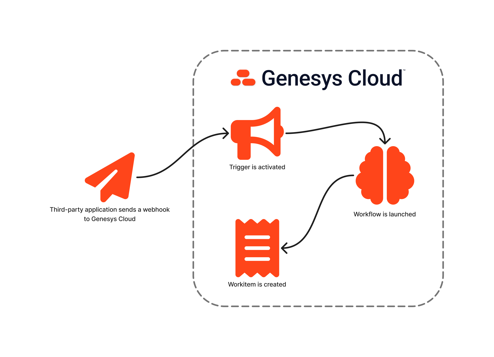
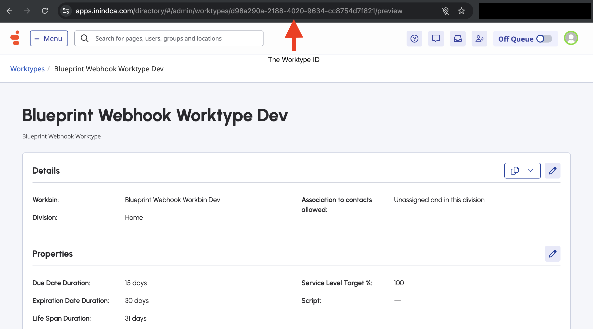
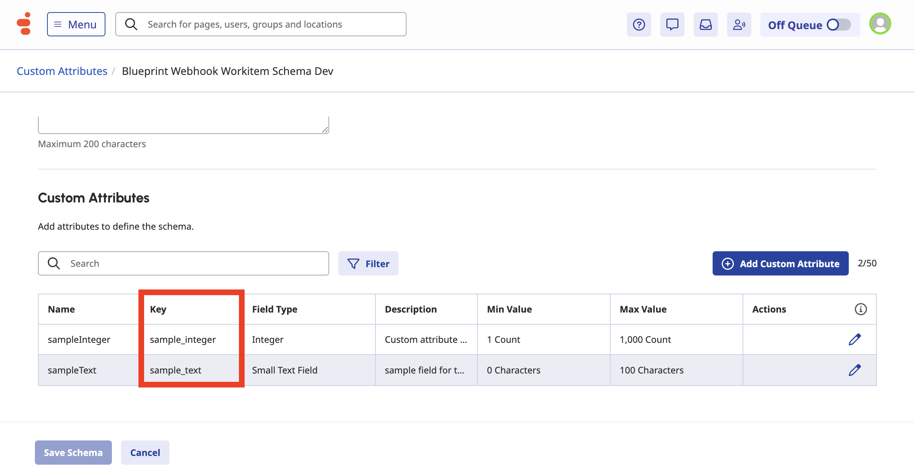
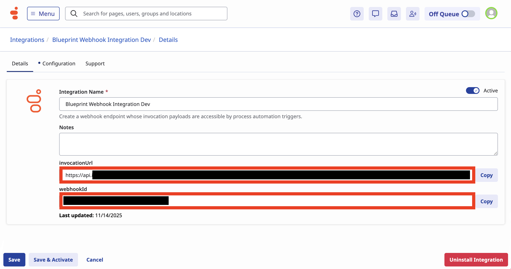
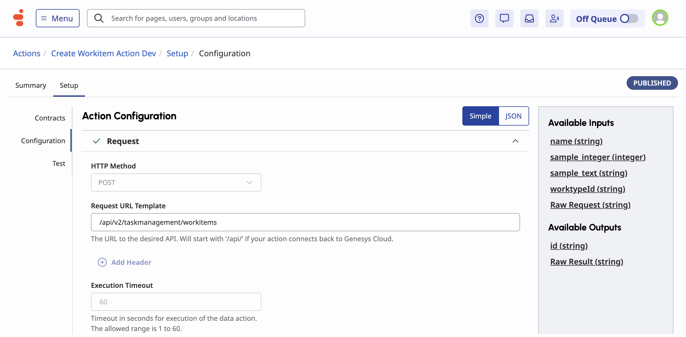
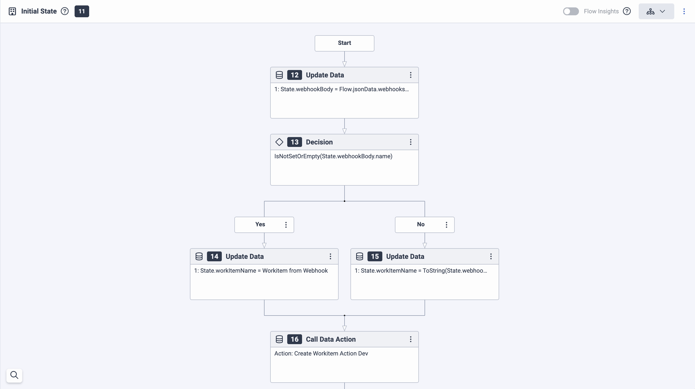
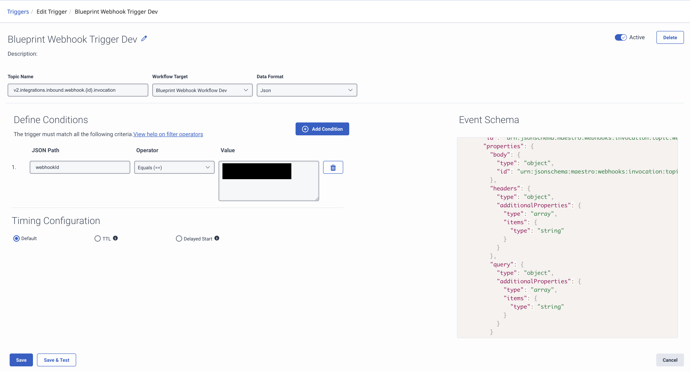
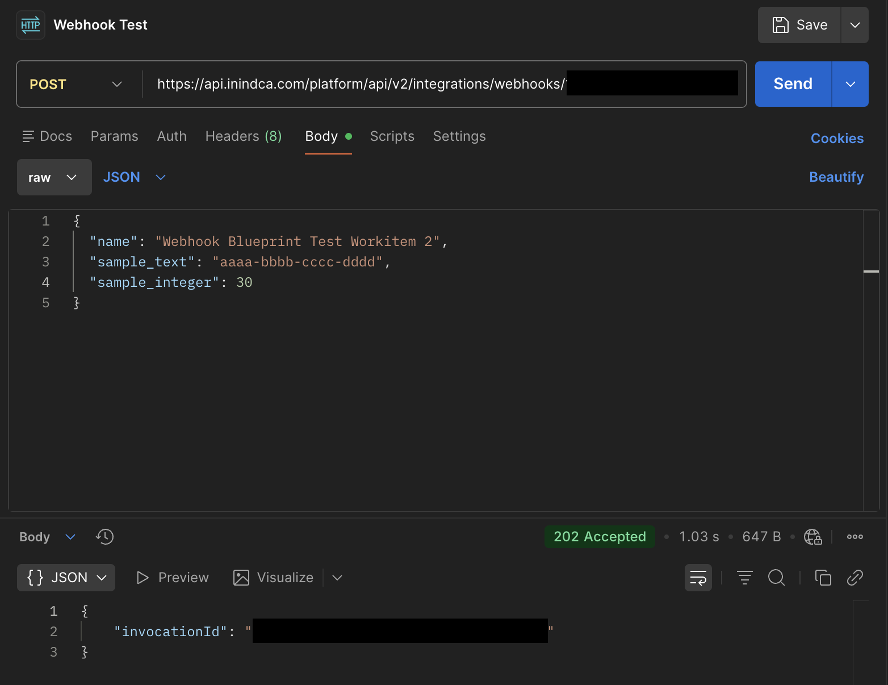
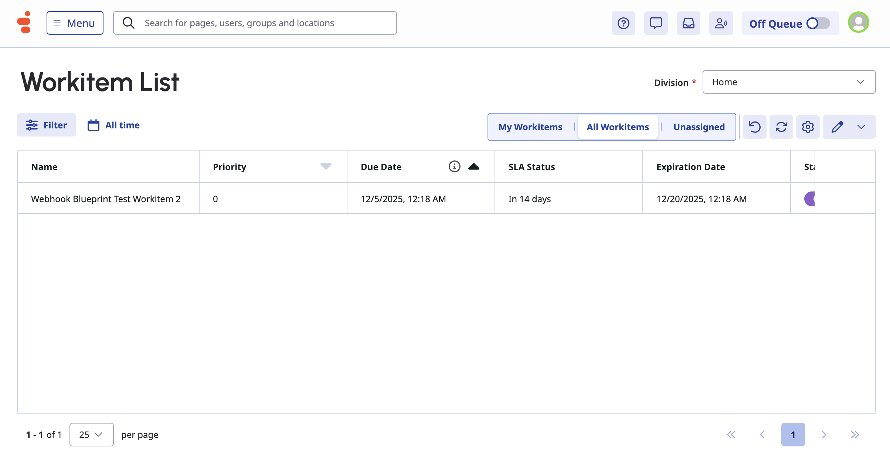
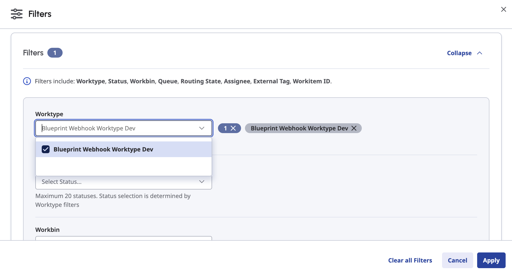

Webhooks are a common way to send notifications from one application to another and can trigger processes. This Genesys Cloud Blueprint provides that template as a jumping off point as Genesys Cloud provides webhooks that can trigger a Genesys Workflow that can fulfill your business processes within Genesys Cloud. In this particular blueprint, the workflow will create a workitem, which is another tool here in Genesys Cloud that can help developers fulfill business processes with ease.



## Solution Components

- **Genesys Cloud** - a suite of Genesys cloud services for enterprise-grade communications, collaboration, and contact center management.
  - **CX as Code** - a tool to declaratively manage Genesys Cloud resources and configuration across organizations using Terraform by HashiCorp.
  - **Triggers** - a process automation tool that allows customers to configure a reaction to specific events that occur within Genesys Cloud.
  - **Data Action** - provides the integration point to invoke a third-party REST web service or the Genesys Cloud API.
  - **Architect flows** - a flow in Architect, a drag and drop web-based design tool, dictates how Genesys Cloud handles workflow.
  - **Work Automation** - a modern, cloud native approach to workitem routing and process automation purpose built for Genesys Cloud. It is intended for work that originates from the contact center to be easily tracked, automated and forecasted for agents.

## Prerequisites

- Specialized Knowledge
  - Administrator-level knowledge of Genesys Cloud.
  - Basic knowledge of Genesys Cloud Architect.
  - Basic knowledge of the Genesys Cloud API.
- Genesys Account Requirements
  - A Genesys Cloud license. For more information, see [Genesys Cloud Pricing](https://www.genesys.com/pricing "Goes to the Genesys Cloud Pricing page").
  - Master Admin role in Genesys Cloud, particularly with permissions in Workitems, Architect, Integrations, and Trigger. For more information, see [Roles and permissions overview](https://help.genesys.cloud/?p=24360 "Goes to the roles and permissions overview in the Genesys Cloud Resource Center") in the Genesys Cloud Resource Center.
  - [OAuth Client](https://help.genesys.cloud/articles/create-an-oauth-client/ "Goes to the Create an OAuth Client article") with the Master Admin role.

## Implementation Steps

This blueprint has 2 implementation steps that allows you to do this manually or use Terraform _(which is highly recommended)_.

- [Clone the repository](#clone-the-repository "Goes to the Clone the Repository section")
- [Manual Implementation via Genesys Cloud UI](#manual-implementation-via-genesys-cloud-ui "Goes to the Manual Implementation via Genesys Cloud UI section")
    1. [Create the Workitem Resources](#create-the-workitem-resources "Goes to the Create the Workitem Resources section")
    2. [Create the Webhook for Events Integration](#create-the-webhook-for-events-integration "Goes to the Create the Webhook for Events Integration section")
    3. [Create the Genesys Cloud Data Action Integration](#create-the-genesys-cloud-data-action-integration "Goes to the Create the Genesys Cloud Data Action Integration section")
    4. [Create and Import the Create Workitem Data Action](#create-and-import-the-create-workitem-data-action "Goes to the Create and Import the Create Workitem Data Action section")
    5. [Create and Import the Workflow](#create-and-import-the-workflow "Goes to the Create and Import the Workflow section")
    6. [Create the Webhook Trigger](#create-the-webhook-trigger "Goes to the Create the Webhook Trigger section")
- [Using Terraform](#using-terraform "Goes to the Using Terraform section")
    1. [Create a Genesys Cloud OAuth Client](#create-a-genesys-cloud-oauth-client "Goes to the Create a Genesys Cloud OAuth Client section")
    2. [Configure the Terraform Project](#configure-the-terraform-project "Goes to the Configure the Terraform Project section")
    3. [Run Terraform](#run-terraform "Goes to the Run Terraform section")
- [Testing](#testing "Goes to the Testing section")

## Clone the Repository

Clone the [webhook-workflow-workitem-blueprint](https://github.com/GenesysCloudBlueprints/webhook-workflow-workitem-blueprint "Goes to the webhook-workflow-workitem-blueprint repository in GitHub") repository in your local machine. You can also run this git command to clone the repository:

```bash
git clone https://github.com/GenesysCloudBlueprints/webhook-workflow-workitem-blueprint.git
```

## Manual Implementation via Genesys Cloud UI

### Create the Workitem Resources

You need a work automation custom attributes, workbin, and worktype to create a workitem. [Instructions on how to create these can be seen here](https://help.genesys.cloud/articles/set-up-work-automation/ "Goes to the Set Up Work Automation article in Genesys Cloud Resource Center").

Do take note of the ID of the worktype you just created by looking at the URL when viewing the worktype. It might look like this `https://{your-genesys-domain}/directory/#/admin/worktypes/{the-worktype-id-is-here}/preview`.



Do also take note of the key of the custom attributes that you have set on a given schema, which will be important when setting up the data actions later.



### Create the Webhook For Events Integration

This step generates the webhook endpoint. Instructions on [how to create the integration can be seen here](https://help.genesys.cloud/articles/add-a-webhook-for-events-integration/ "Goes to the Add a webhook for events integration article in Genesys Cloud Resource Center"). Take note of the `InvocationUrl` and `Webhookid`.



### Create the Genesys Cloud Data Action Integration

This step is needed to be able to create a data action that will create a workitem. Instructions on [how to create the integration can be seen here](https://help.genesys.cloud/articles/add-a-data-actions-integration/#tab3 "Goes to the Add a data actions integration article in Genesys Cloud Resource Center").

### Create and Import the Create Workitem Data Action

The data action to import (that is in JSON format) is in the `/exports` folder in the [blueprint repository](#clone-the-repository "Goes to the Clone the Repository section") namely `CreateWorkitemDataAction.json`.

You can import the data actions using the following steps:

1. In Genesys Cloud, navigate to **Menu** > **IT and Integrations** > **Data Actions** and click **Import**.
2. Select the json file and associate with the [Genesys Cloud Data Action Integration](#create-the-genesys-cloud-data-action-integration "Goes to the Create the Genesys Cloud Data Action Integration section").
3. Click **Import Action**.
4. Click **Save & Publish**.

:::primary
**Note**: You may need to modify the input contract and the request body template if you have modified or added any additional custom fields in your [created worktype](#create-the-workitem-resources "Goes to the Create the Workitem Resources section") or want to add additional properties when creating a workitem. The custom fields in the imported data action are `sample_text` and `sample_integer` that are mapped to the same key name. Additional properties of calling the endpoint `POST /api/v2/taskmanagement/workitems` [can be seen here](https://developer.genesys.cloud/commdigital/taskmanagement/#post-api-v2-taskmanagement-workitems "Goes to the Task Management in Work Automation Overview article in Genesys Cloud Developer Center").
:::



### Create and Import the Workflow

There is an additional file in the `/exports` folder in the [blueprint repository](#clone-the-repository "Goes to the Clone the Repository section") which is `WebhookWorkflow.i3WorkFlow` that contains the workflow.

#### Import the Workflow

1. In Genesys Cloud, navigate to **Admin** > **Architect** > **Flows:Workflow** and click **Add**.

2. Enter a name for the workflow and click **Create Flow**.

3. From the **Save** menu, click **Import**.

4. Select the `WebhookWorkflow.i3WorkFlow` file from `/exports` and click **Import**.

5. Click the `Call Data Action` step and select the [data action that we just created](#create-and-import-the-create-workitem-data-action "Goes to the Create and Import the Create Workitem Data Action section") and fill out the Inputs. If you want to fetch the JSON data from the webhook, it is assigned in the variable `State.webhookBody`. Set the `worktypeId` with the ID of the [worktype you just created](#create-the-workitem-resources "Goes to the Create the Workitem Resources section").

6. Click **Save** and then click **Publish**.



:::primary
**Note**: The workflow doesn't include validation logic that checks if a certain property is in the JSON object from the webhook. Passing a null value to a certain function may cause errors and will make the workflow run improperly. Ensure to add error handling logic to prevent unexpected errors.
:::

### Create the Webhook Trigger

Creating a trigger can be seen in [this article](https://help.genesys.cloud/articles/create-a-trigger/ "Goes to Create a Trigger article in the Genesys Cloud Resource Center").

To create a webhook trigger, you may [follow the configurations in this article here](https://help.genesys.cloud/articles/create-triggers-to-filter-events-by-webhook/ "Goes to the Create triggers to filter events by webhook article in Genesys Cloud Resource Center"). Take note that you'll be needing the [Webhookid](#create-the-webhook-for-events-integration "Goes to the Create the webhook for events integration section") in this and ensure that the trigger is active once created.



## Using Terraform

When going with this step, ensure that you have installed [Terraform](https://developer.hashicorp.com/terraform/install "Goes to the Terraform website") on your machine.

### Create a Genesys Cloud OAuth Client

The use of an OAuth Client is required for Terraform to create your Genesys Cloud resources. Instructions on how to create one is in this [article](https://help.genesys.cloud/articles/create-an-oauth-client/ "Goes to create an OAuth Client in Genesys Cloud Resource Center"). Do take note of and store securely both the generated `Client ID` and `Client Secret`.

### Configure the Terraform Project

#### Configure the environment variables

In the root directory of the repository, set the following environment variables in your local machine's terminal window before you run this project using the Terraform provider:

- `GENESYSCLOUD_OAUTHCLIENT_ID` - This variable is the Genesys Cloud Client Credential Grant ID that CX as Code executes against.
- `GENESYSCLOUD_OAUTHCLIENT_SECRET` - This variable is the Genesys Cloud Client Credential Secret that CX as Code executes against.
- `GENESYSCLOUD_REGION` - This variable is the Genesys Cloud region in your organization.

These can also be seen in the `dev.env.sh` file for you to use and run to set as environment variables.

#### Configure the Terraform build

In the root directory of the repository, open `dev.auto.tfvars` file, where you need to set the following:

- `client_id` - The Genesys Cloud Client Credential Grant ID that CX as Code executes against for the Genesys Cloud Data Action Integration.
- `client_secret` - The Genesys Cloud Client Credential Grant Secret that CX as Code executes against for the Genesys Cloud Data Action Integration.
- `environment_name` - The affix that will be added to the names of generated resources.
- `genesys_division_name` - The division name where the Genesys Cloud objects will be created.

:::primary
**Important**: Do not commit a change in the `.tfvars` file that involves saving sensitive information.
:::

### Run Terraform

The blueprint solution is now ready for your organization to use.

To run, issue the following commands:

- `terraform init` - This command initializes a working directory containing Terraform configuration files.  
- `terraform plan` - This command executes a trial run against your Genesys Cloud organization and displays a list of all the Genesys Cloud resources Terraform created. Review this list and make sure that you are comfortable with the plan before you continue to the next step.
- `terraform apply --auto-approve` - This command creates and deploys the necessary objects in your Genesys Cloud account. The `--auto-approve` flag provides the required approval before the command creates the objects. It will then provide the generated `invocationURL` and `webhookID` of the webhook for testing.

After the `terraform apply --auto-approve` command successfully completes, you can see the output of the command's entire run along with the number of objects that Terraform successfully created. Keep the following points in mind:

- This project assumes that you run this blueprint solution with a local Terraform backing state, which means that the `tfstate` files are created in the same folder where you run the project. Terraform recommends that you use local Terraform backing state files **only** if you run from a desktop or are comfortable deleting files.

- As long as you keep your local Terraform backing state projects, you can tear down this blueprint solution. To tear down the solution, change to the `docs/terraform` folder and issue the  `terraform destroy --auto-approve` command. This command destroys all objects that the local Terraform backing state currently manages.

## Testing

To test the solution, you can use a tool like [Postman](https://www.postman.com/downloads/ "Goes to the Postman download page") to send a POST request to the `InvocationUrl` generated when you created the [Webhook for Events Integration](#create-the-webhook-for-events-integration "Goes to the Create the Webhook for Events Integration section") or the output when running `terraform apply`. Ensure that the request body contains the fields necessary for your workflow to be able to create the workitem properly.



You may also test it via cURL like this:

```bash
curl -X POST \
  '{webhookInvocationUrl}' \
  -H 'Content-Type: application/json' \
  -d '{
        "sample_text": "New Resource",
        "sample_integer": 123
      }'
```

The request will return an HTTP `202` response if the webhook successfully accepted it. You may check the Workitem list located in **Menu** > **Workspace** > **Task List** to see if the workitem is created properly.



You may also filter the list to that limits the list to the specific worktype used to create the workitem.



## Additional Resources

- [Using Webhook For Events](https://developer.genesys.cloud/blog/2025-11-14-webhook-for-events/ "Goes to the Using Webhook for Events blog in the Genesys Cloud Developer Center") Blog
- [Task Management in Work Automation Overview](https://developer.genesys.cloud/commdigital/taskmanagement/ "Goes to the Task Management in Work Automation Overview in the Genesys Cloud Developer Center")
- [Genesys Work Automation](https://help.genesys.cloud/usecases/genesys-work-automation-bo01/ "Goes to the Genesys Work Automation article in the Genesys Cloud Resource Center")
- [Triggers Overview](https://developer.genesys.cloud/platform/process-automation/#example-of-an-event-schema "Goes to the Triggers Overview in the Genesys Cloud Developer Center")
- [About Webhook for Events](https://help.genesys.cloud/articles/about-webhook-for-events/ "Goes to the About Webhook for Events article in the Genesys Cloud Resource Center")
- [About the Genesys Cloud data actions integration](https://help.genesys.cloud/articles/about-genesys-cloud-data-actions-integration/ "Goes to the About the Genesys Cloud data actions integration article in the Genesys Cloud Resource Center")
- [About Genesys Cloud Architect](https://help.genesys.cloud/articles/about-architect/ "Goes to the About Architect article in the Genesys Cloud Resource Center")
- [webhook-workflow-workitem-blueprint](https://github.com/GenesysCloudBlueprints/webhook-workflow-workitem-blueprint "Goes to the webhook-workflow-workitem-blueprint repository in GitHub") repository
